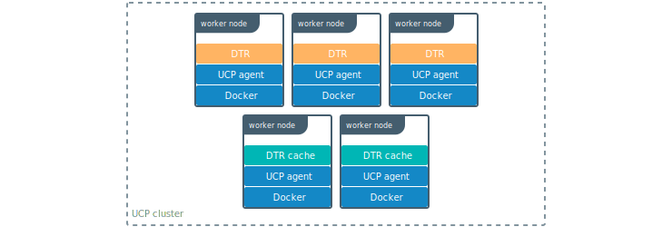
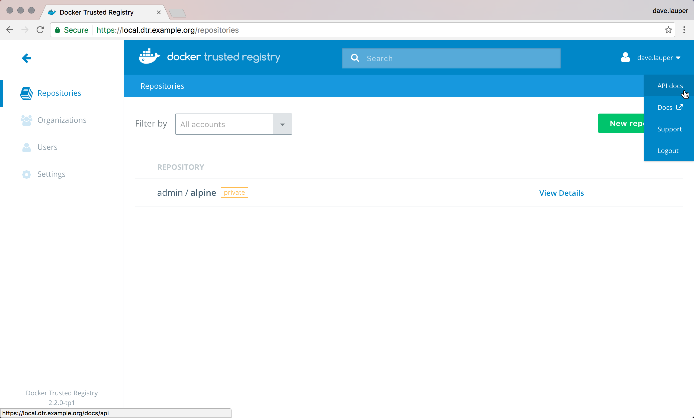
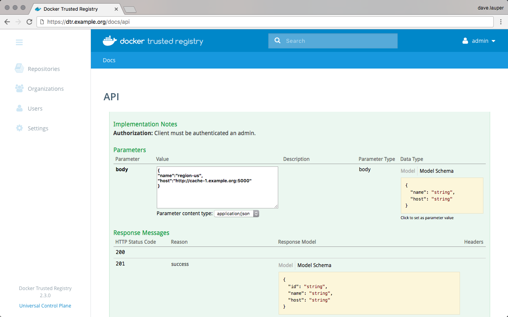
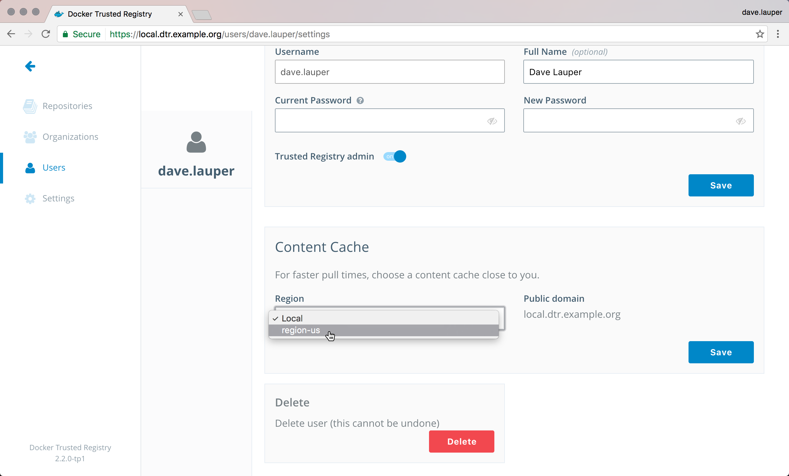

You can configure DTR to have multiple caches. Once you've deployed caches,
users can configure their DTR user account to specify which cache to pull from.

Then, when users pull from DTR, they are redirected to pull from the cache
configured on their user account. By deploying caches geographically closer to remote
offices and low connectivity areas, users can pull images faster.

User requests are authenticated when pulling from a cache. Users can only pull
images from a cache if they have access. And if the image has changed in DTR,
users will pull the latest version, not an outdated one.

## How caches work

After you've deployed the caches, users can configure which cache to
pull from on their DTR user settings page.


When users try to pull an image by running
`docker pull <dtr-url>/<org>/<repository>`, the following happens:

1. The Docker client makes a request to DTR which in turn authenticates the
request
2. The Docker client requests the image manifest to DTR. This ensures that
users will always pull the correct image, and not an outdated version
3. The Docker client requests the layer blobs to DTR, which becomes signed
and redirected to the cache configured by the user
4. If the blob exists on the cache it is sent to the user. Otherwise, the cache
pulls it from DTR and sends it to the user

When a user pushes an image, that image is pushed directly to DTR. A cache
will only store the image when a user tries to pull the image using that cache.

## Configure the cache

DTR caches are based on Docker Registry, and use the same configuration
file format.
[Learn more about the configuration options](/registry/configuration.md).

The DTR cache extends the Docker Registry configuration file format by
introducing a new middleware called `downstream` that has three configuration
options: `blobttl`, `upstreams`, and `cas`:

```none
# Settings that you would include in a
# Docker Registry configuration file followed by

middleware:
  registry:
      - name: downstream
        options:
          blobttl: 24h
          upstreams:
            - originhost: <Externally-reachable address for the origin registry>
              upstreamhosts:
                - <Externally-reachable address for upstream content cache A>
                - <Externally-reachable address for upstream content cache B>
          cas:
            - <Absolute path to upstream content cache A certificate>
            - <Absolute path to upstream content cache B certificate>
```

Below you can find the description for each parameter, specific to DTR caches.

<table>
  <tr>
    <th>Parameter</th>
    <th>Required</th>
    <th>Description</th>
  </tr>
  <tr>
    <td>
      <code>blobttl</code>
    </td>
    <td>
      no
    </td>
    <td>
The TTL for blobs in the cache. This field takes a positive integer and an optional suffix indicating the unit of time. If
this field is configured, "storage.delete.enabled" must be configured to true. Possible units are:
      <ul>
        <li><code>ns</code> (nanoseconds)</li>
        <li><code>us</code> (microseconds)</li>
        <li><code>ms</code> (milliseconds)</li>
        <li><code>s</code> (seconds)</li>
        <li><code>m</code> (minutes)</li>
        <li><code>h</code> (hours)</li>
      </ul>
    If you omit the suffix, the system interprets the value as nanoseconds.
    </td>
  </tr>
  <tr>
    <td>
      <code>cas</code>
    </td>
    <td>
      no
    </td>
    <td>
      A list of absolute paths to PEM-encoded CA certificates of upstream registries.
    </td>
  </tr>
<tr>
  <td>
    <code>originhost</code>
  </td>
  <td>
    yes
  </td>
  <td>
      An externally-reachable address for the origin registry, as a fully qualified URL.
  </td>
</tr>
<tr>
  <td>
    <code>upstreamhosts</code>
  </td>
  <td>
    no
  </td>
  <td>
    A list of externally-reachable addresses for upstream registries for cache chaining. If more than one host is specified, pulls from upstream content caches will be done in round-robin order.
  </td>
</tr>
</table>

## Deploy a simple cache

You can deploy a Docker Content Cache on any host that has Docker installed.
The only requirements are that:

* Users need to have access to both DTR and the cache
* The cache needs access to DTR



On the host where the cache will be deployed, create a `config.yml` file with
the following content:

```
version: 0.1
storage:
  delete:
    enabled: true
  filesystem:
    rootdirectory: /var/lib/registry
http:
  addr: :5000
middleware:
  registry:
      - name: downstream
        options:
          blobttl: 24h
          upstreams:
            - originhost: https://<dtr-url>
          cas:
            - /certs/dtr-ca.pem
```

This configures the cache to store the images in the directory
`/var/lib/registry`, exposes the cache service on port 5000, and configures the
cache to delete images that are not pulled in the last 24 hours. It also
defines where DTR can be reached, and which CA certificates should be trusted.

Now we need to download the CA certificate used by DTR. For this, run:

```
curl -k https://<dtr-url>/ca > dtr-ca.pem
```

Now that we've got the cache configuration file and DTR CA certificate, we can
deploy the cache by running:

```none
docker run --detach --restart always \
  --name dtr-cache \
  --publish 5000:5000 \
  --volume $(pwd)/dtr-ca.pem:/certs/dtr-ca.pem \
  --volume $(pwd)/config.yml:/config.yml \
  {{ page.dtr_org }}/dtr-content-cache:{{ page.dtr_version }} /config.yml
```

You can also run the command in interactive mode instead of detached by
replacing `--detached` with `--interactive`. This allows you to
see the logs generated by the container and troubleshoot misconfigurations.

Now that you've deployed a cache, you need to configure DTR to know about it.
This is done using the `POST /api/v0/content_caches` API. You can use the
DTR interactive API documentation to use this API.

In the DTR web UI, click the top-right menu, and choose **API docs**.

{: .with-border}

Navigate to the `POST /api/v0/content_caches` line and click it to expand.
In the **body** field include:

```
{
  "name": "region-us",
  "host": "http://<cache-public-ip>:5000"
}
```

Click the **Try it out!** button to make the API call.

{: .with-border}

Now that DTR knows about the cache we've created, we just need to configure
our DTR user settings to start using that cache.

In the DTR web UI, navigate to your **user profile**, click the **Settings**
tab, and change the **Content Cache** settings to use the **region-us** cache.

{: .with-border}

Now when you pull images, you'll be using the cache. To test this, try pulling
an image from DTR. You can inspect the logs of the cache service, to validate
that the cache is being used, and troubleshoot problems.

In the host where you've deployed the `region-us` cache, run:

```
docker container logs dtr-cache
```

## Where to go next

* [Deploy caches with TLS](tls.md)
