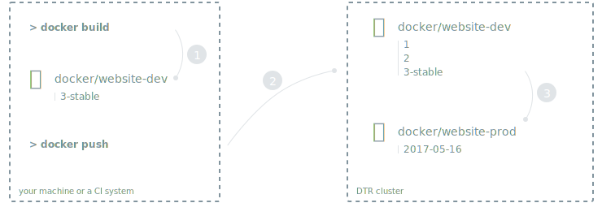
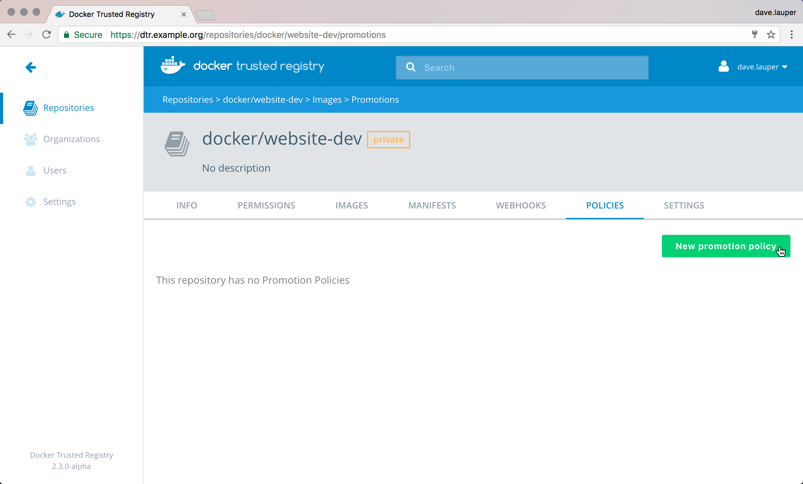
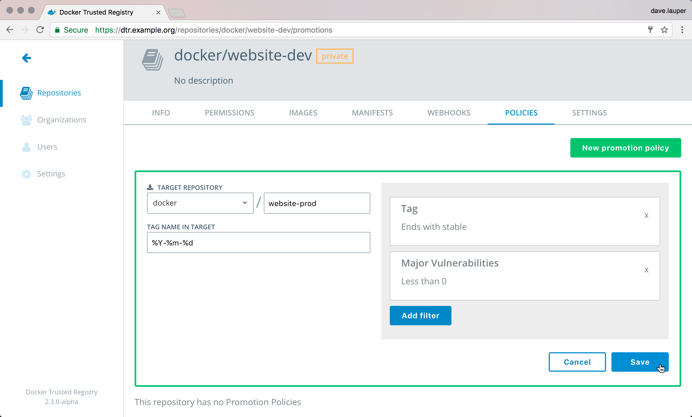
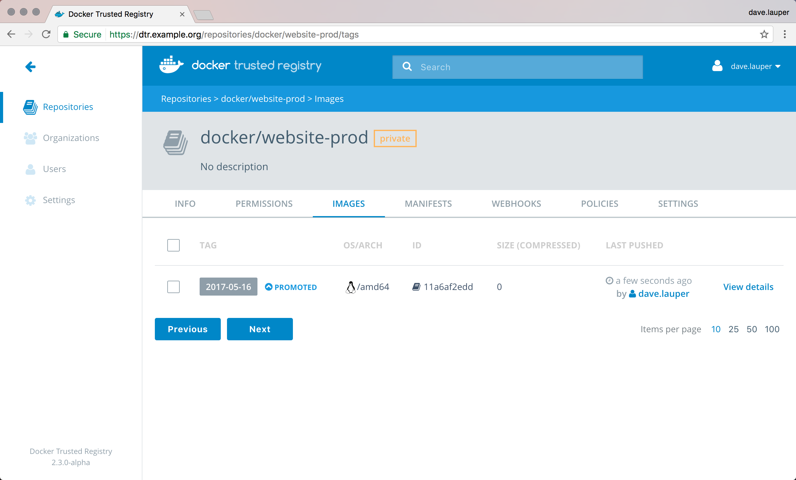

Once you've made changes to your application and want to make them available
to your users, you typically push an image to DTR, or have a CI/CD pipeline
that does it for you. A team responsible for QA will notice you've pushed
a new image, run tests, and if the image is working as expected, they'll
promote it to production.

As an example, you push the image to `docker/website-dev:3-stable`, the QA team will
pull and test it, and push it as `docker/website-prod:latest`

DTR allows you to automate this. If the image you pushed to DTR meets certain
criteria, like it has a specific name, and doesn't have any vulnerabilities,
the image is automatically promoted.
You can combine multiple promotion criteria, and chain promotion rules, to
build complex deployment pipelines.

In this example, we're going to create a promotion policy for the
`docker/website-dev` repository.

## Configure your repository

In the DTR **web UI**, navigate to the **repository details** and
choose **policies**.

{: .with-border}

Click **new promotion policy**, and define that criteria that an image needs
to meet to be promoted.

DTR allows defining the following criteria:

| Name            | Description                                        |
|:----------------|:---------------------------------------------------|
| Tag name        | If the tag name contains                           |
| Vulnerabilities | If the image has vulnerabilities                   |
| License         | If the image uses an intellectual property license |

Then, select where to push the image to if it meets all the criteria.
Select the **organization** and **repository** where the image is going to be
push, and define the **tag**. You can use these template keywords to define
your new tag:

| Template | Description                     | Example result    |
|:---------|:--------------------------------|:------------------|
| %n       | The tag to promote              | 1, 4.5, latest    |
| %A       | Day of the week                 | Sunday, Monday    |
| %a       | Day of the week, abbreviated    | Sun, Mon , Tue    |
| %w       | Day of the week, as a number    | 0, 1, 6           |
| %d       | Number for the day of the month | 01, 15, 31        |
| %B       | Month                           | January, December |
| %b       | Month, abbreviated              | Jan, Jun, Dec     |
| %m       | Month, as a number              | 01, 06, 12        |
| %Y       | Year                            | 1999, 2015, 2048  |
| %y       | Year, two digits                | 99, 15, 48        |
| %H       | Hour, in 24 hour format         | 00, 12, 23        |
| %I       | Hour, in 12 hour format         | 01, 10, 10        |
| %p       | Period of the day               | AM, PM            |
| %M       | Minute                          | 00, 10, 59        |
| %S       | Second                          | 00, 10, 59        |
| %f       | Microsecond                     | 000000, 999999    |
| %Z       | Name for the timezone           | UTC, PST, EST     |
| %j       | Day of the year                 | 001, 200, 366     |
| %W       | Week of the year                | 00, 10 , 53       |

In this example, if a tag in the `docker/website-dev` doesn't have
vulnerabilities and the tag name contains `stable`, we'll automatically
push that image to `docker/website-prod` and tag it with the timestamp of
when the image was promoted.

{: .with-border}

Everything is set up, and once we push a new image, if it complies with all
the policies, it automatically gets promoted.

{: .with-border}

## Create complex pipelines

You can create several promotion policies in a repository, chain
promotion policies across different repositories, and also use promotion
policies with webhooks. This allows you to create flexible deployment
pipelines.

Also, users don't need access to all repositories in the promotion pipeline.
A repository admin can define the promotion policies, and only
allow access to push to the first repository in that pipeline. Once users push
to the fist repository, the image gets promoted to the other repositories as
long as it satisfies the promotion policies.
