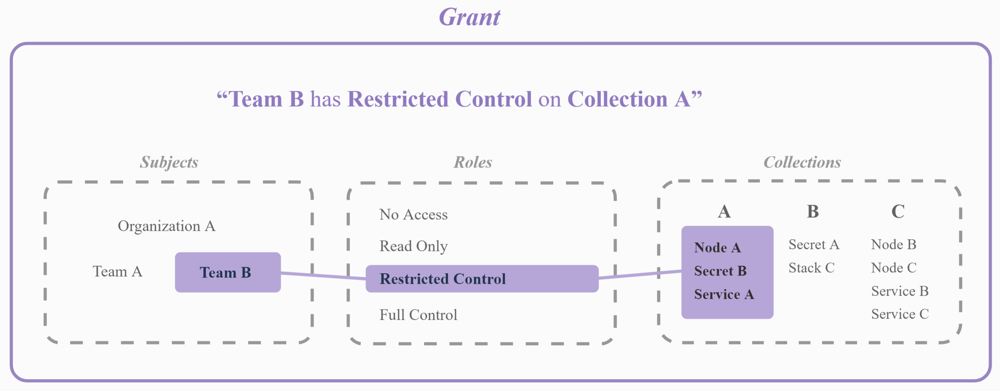

With Docker Universal Control Plane, you get to control who can create and
edit container resources in your swarm, like services, images, networks,
and volumes. You can grant and manage permissions to enforce fine-grained
access control as needed.

## Grant access to swarm resources  

If you're a UCP administrator, you can create *grants* to control how users 
and organizations access swarm resources.

A grant is made up of a *subject*, a *role*, and a *resource collection*.
A grant defines who (subject) has how much access (role) 
to a set of resources (collection).
[Learn how to grant permissions to users based on roles](grant-permissions.md).

An administrator is a user who can manage grants, subjects, roles, and
collections. An administrator identifies which operations can be performed
against specific resources and who can perform these actions. An administrator
can create and manage role assignments against subject in the system.
Only an administrator can manage subjects, grants, roles, and collections. 

## Subjects

A subject represents a user, team, or organization. A subject is granted a
role for a collection of resources.

-   **User**: A person that the authentication backend validates. You can
    assign users to one or more teams and one or more organizations.
-   **Organization**: A group of users that share a specific set of
    permissions, defined by the roles of the organization.
-   **Team**: A group of users that share a set of permissions defined in the
    team itself. A team exists only as part of an organization, and all of its
    members must be members of the organization. Team members share
    organization permissions. A team can be in one organization only.

## Roles

A role is a set of permitted API operations that you can assign to a specific
subject and collection by using a grant. UCP administrators view and manage
roles by navigating to the **Roles** page.
[Learn more about roles and permissions](permission-levels.md). 

## Resource collections

Docker EE enables controlling access to swarm resources by using
*collections*. A collection is a grouping of swarm resources, like
volumes, networks, secrets, and services, that you access by specifying
a directory-like path. 
[Manage access to resources by using collections](manage-access-with-collections.md).

## Transition from UCP 2.1 access control

-   Your existing access labels and permissions are migrated automatically
    during an upgrade from UCP 2.1.x.
-   Unlabeled "user-owned" resources are migrated into the user's private
    collection, in `/Shared/Private/<username>`.
-   Old access control labels are migrated into `/Shared/Legacy/<labelname>`.
-   When deploying a resource, choose a collection instead of an access label.
-   Use grants for access control, instead of unlabeled permissions.

## Where to go next

-  [Create and manage users](create-and-manage-users.md)
-  [Create and manage teams](create-and-manage-teams.md)
-  [Deploy a service with view-only access across an organization](deploy-view-only-service.md)
-  [Isolate volumes between two different teams](isolate-volumes-between-teams.md)
-  [Isolate swarm nodes between two different teams](isolate-nodes-between-teams.md)

