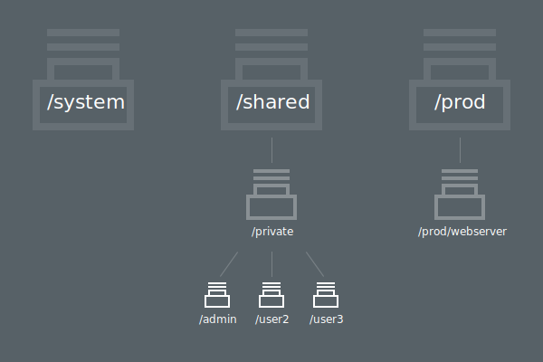
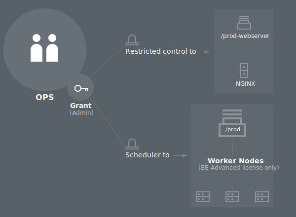

Docker EE enables controlling access to container resources by using
*collections*. A collection is a group of swarm resources,
like services, containers, volumes, networks, and secrets.

Access to collections goes through a directory structure that arranges a
swarm's resources. To assign permissions, administrators create grants
against directory branches.

## Directory paths define access to collections

Access to collections is based on a directory-like structure.
For example, the path to a user's default collection is
`/Shared/Private/<username>`. Every user has a private collection that
has the default permission specified by the UCP administrator. 

Each collection has an access label that identifies its path. 
For example, the private collection for user "hans" has a label that looks
like this: 

```
com.docker.ucp.access.label = /Shared/Private/hans
```

You can nest collections. If a user has a grant against a collection,
the grant applies to all of its child collections.

For a child collection, or for a user who belongs to more than one team,
the system concatenates permissions from multiple roles into an
"effective role" for the user, which specifies the operations that are
allowed against the target.

## Built-in collections

UCP provides a number of built-in collections.

-  `/` - The path to the `Swarm` collection. All resources in the
   cluster are here. Resources that aren't in a collection are assigned
   to the `/` directory.
-  `/System` - The system collection, which contains UCP managers, DTR nodes,
   and UCP/DTR system services. By default, only admins have access to the 
   system collection, but you can change this.
-  `/Shared` - All worker nodes are here by default, for scheduling.
   In a system with a standard-tier license, all worker nodes are under
   the `/Shared` collection. With the EE Advanced license, administrators
   can move worker nodes to other collections and apply role-based access.  
-  `/Shared/Private` - User private collections are stored here.
-  `/Shared/Legacy` - After updating from UCP 2.1, all legacy access control
   labels are stored here.



## Default collections

A user always has a default collection. The user can select the default
in UI preferences. When a user deploys a resource in the web UI, the
preselected option is the default collection, but this can be changed.

Users can't deploy a resource without a collection.  When deploying a
resource in CLI without an access label, UCP automatically places the
resource in the user's default collection.
[Learn how to add labels to cluster nodes](../configure/add-labels-to-cluster-nodes/).

When using Docker Compose, the system applies default collection labels
across all resources in the stack, unless the `com.docker.ucp.access.label`
has been set explicitly.

> Default collections and collection labels
> 
> Setting a default collection is most helpful for users who deploy stacks
> and don't want to edit the contents of their compose files. Also, setting
> a default collection is useful for users who work only on a well-defined
> slice of the system. On the other hand, setting the collection label for
> every resource works best for users who have versatile roles in the system,
> like administrators.

## Collections and labels

Resources are marked as being in a collection by using labels.
Some resource types don't have editable labels, so you can't move resources
like this across collections. You can't modify collections after
resource creation for containers, networks, and volumes, but you can
update labels for services, nodes, secrets, and configs. 

For editable resources, like services, secrets, nodes, and configs,
you can change the `com.docker.ucp.access.label` to move resources to
different collections. With the CLI, you can use this label to deploy
resources to a collection other than your default collection. Omitting this
label on the CLI deploys a resource on the user's default resource collection.

The system uses the additional labels, `com.docker.ucp.collection.*`, to enable
efficient resource lookups. By default, nodes have the
`com.docker.ucp.collection.root`, `com.docker.ucp.collection.shared`, and
`com.docker.ucp.collection.swarm` labels set to `true`. UCP automatically 
controls these labels, and you don't need to manage them.

Collections get generic default names, but you can give them meaningful names,
like "Dev", "Test", and "Prod".

A *stack* is a group of resources identified by a label. You can place the
stack's resources in multiple collections. Resources are placed in the user's
default collection unless you specify an explicit `com.docker.ucp.access.label`
within the stack/compose file.

## Control access to nodes

The Docker EE Advanced license enables access control on worker nodes.



When you deploy a resource with a collection, UCP sets a constraint implicitly
based on what nodes the collection, and any ancestor collections, can access. 
The `Scheduler` role allows users to deploy resources on a node.
By default, all users have the `Scheduler` role against the `/Shared`
collection.

When deploying a resource that isn't global, like local volumes, bridge
networks, containers, and services, the system identifies a set of
"schedulable nodes" for the user. The system identifies the target collection
of the resource, like `/Shared/Private/hans`, and it tries to find the parent
that's closest to the root that the user has the `Node Schedule` permission on.

For example, when a user with a default configuration runs `docker container run nginx`,
the system interprets this to mean, "Create an `nginx` container under the
user's default collection, which is at `/Shared/Private/hans`, and deploy it
on one of the nodes under `/Shared`.

If you want to isolate nodes against other teams, place these nodes in
new collections, and assign the `Scheduler` role, which contains the
`Node Schedule` permission, to the two teams. For more info, see
[Isolate swarm nodes between two different teams](isolate-nodes-between-teams.md).