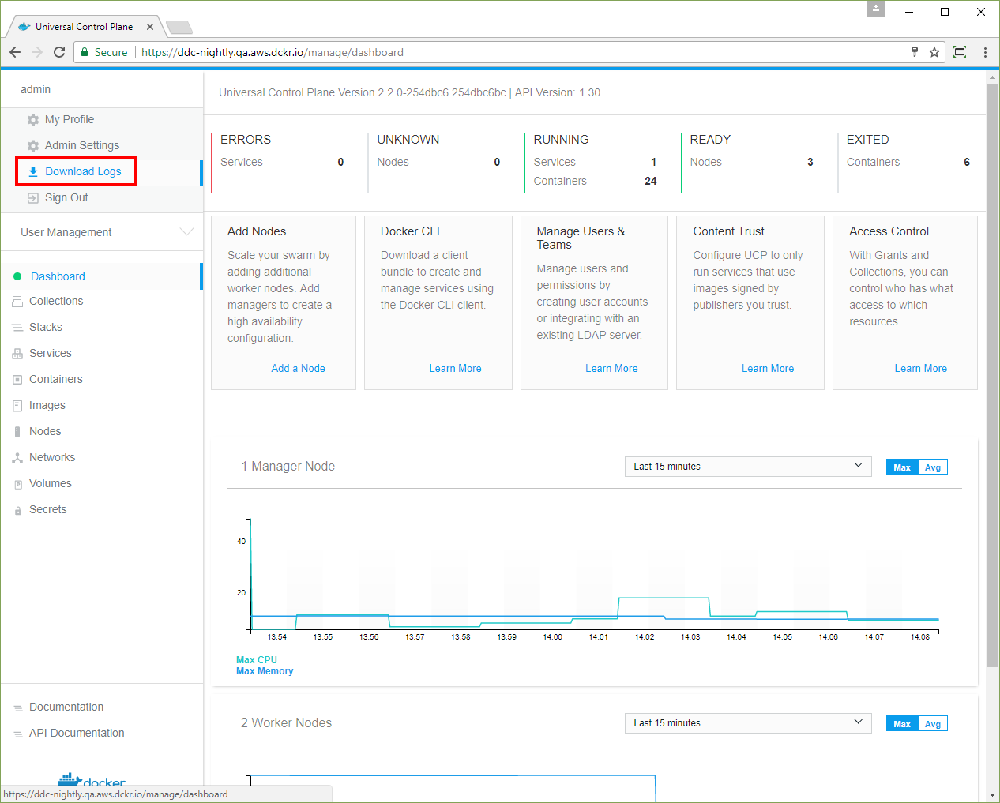

Your Docker Enterprise Edition subscription gives you access to prioritized
support. The service levels depend on your subscription.

If you need help, you can file a ticket via:

* [Email](mailto:support@docker.com)
* [Docker support page](https://support.docker.com/)

Be sure to use your company email when filing tickets.

Docker Support engineers may ask you to provide a UCP support dump, which is an
archive that contains UCP system logs and diagnostic information. To obtain a
support dump:

## From the UI

1. Log into the UCP web UI with an administrator account.
2. In the top-left menu, click your username and choose
   **Download Logs**.

{: .with-border}

## From the CLI

To get the support dump from the CLI, use SSH to log into a UCP manager node
and run:

```none
docker container run --rm \
  --name ucp \
  -v /var/run/docker.sock:/var/run/docker.sock \
  {{ page.ucp_org }}/{{ page.ucp_repo }}:{{ page.ucp_version }} \
  support > docker-support.tgz
```

This support dump only contains logs for the node where you're running the
command. If your UCP is highly available, you should collect support dumps
from all of the manager nodes.

On Windows worker nodes, run the following command to generate a local support dump:

```ps
PS> docker run --name windowssupport -v 'C:\ProgramData\docker\daemoncerts:C:\ProgramData\docker\daemoncerts' -v 'C:\Windows\system32\winevt\logs:C:\eventlogs:ro' docker/ucp-dsinfo-win; docker cp windowssupport:'C:\dsinfo' .; docker rm -f windowssupport
```
